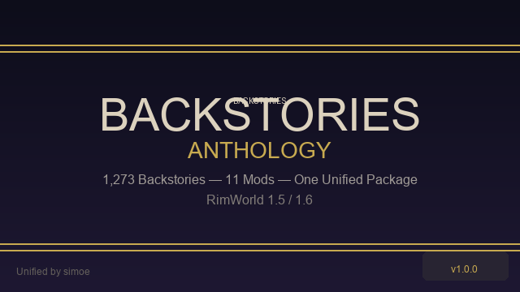

  

<h1 align="center">Backstories Anthology</h1>

  <b>1,273 backstories · 11 mods · One unified package</b> 
  <i>A massive collection of community-created backstories for RimWorld, carefully merged, deduplicated, and balanced into one cohesive, self-contained mod.</i>

  
  
  
  

---

## 📖 Description

**Backstories Anthology** brings together backstories from **11 different community mods** into a single, polished, conflict-free package. Every backstory has been prefixed with `UB_` to ensure zero defName collisions, fully translated (English), deduplicated, and validated.

**No original mods required.** This mod is 100% standalone — just activate it and your colonists will have access to all 1,273 backstories.

### What's Included

- **1,273 unique backstories** — Childhood & Adulthood, spanning Tribal to Spacer tech levels
- **Full English translations** for every single backstory (title + description)
- **No duplicates** — carefully deduplicated across all source mods
- **No defName conflicts** — all backstories use the `UB_` prefix
- **RimWorld 1.5 & 1.6** — fully mirrored load folders
- **Integrated systems:** Reasonable Moods & Capable Backstories (DLL + patches), Elderhood Backstories (DLL)
- **4 additional PlaceDefs** from Seal's Collection for procedural story generation
- **All DLCs supported** — Royalty, Ideology, Biotech, Anomaly

---

## 📋 Backstory Count by Source

| # | Mod | Author | Backstories |
|---|-----|--------|:-----------:|
| 1 | **Cybranian Backstories+** | DimonSever000 | 401 |
| 2 | **Before the Crash: Backstories** | Ostrich-Hungry | 206 |
| 3 | **Vanilla Backstories Expanded** | Oskar Potocki, Legodude17 | 174 |
| 4 | **Seal's Backstory Collection** (v1.0–v1.3) | SneezingSeal | 137 |
| 5 | **Medieval Backstories** | Shenanigans | 107 |
| 6 | **More Backstories** | Ravinglegend | 58 |
| 7 | **Kurzaen's Serious & Silly Backstories** | Kurzaen | 56 |
| 8 | **Tribal Backstories** | Shenanigans | 55 |
| 9 | **Elderhood Backstories** | DimonSever000 | 42 |
| 10 | **Apocalyptic Backstories** | Lovely | 25 |
| 11 | **Saito's Backstories** | Zaljerem / Saito Yui | 12 |
| | **Total** | | **1,273** |

### Integrated Systems (no new backstories)

| System | Author | Description |
|--------|--------|-------------|
| **Reasonable Moods & Capable Backstories** | Legator | 8 balancing patches applied directly to backstory definitions. DLL, InteractionDefs, ThoughtDefs, and mood system included. |
| **Elderhood Backstory System** | DimonSever000 | Harmony DLL and patches for Elderhood-specific backstories. |

---

## 🎯 Features

- **One mod to rule them all** — replaces 12 separate mods with a single, conflict-free package
- **Surgically balanced** — RMCB patches applied directly: nonsensical work disables removed, skill penalties added instead
- **Fully translated** — every backstory has complete English title and description
- **No alien race dependency** — Medieval Backstories converted from `AlienRace.AlienBackstoryDef` to standard `BackstoryDef`
- **All PlaceDefs included** — Seal's custom locations enrich procedural story generation
- **Tested & validated** — 38 automated regression tests pass 100%

---

## ⚙️ Installation

### Manual
1. Download the latest release from [Releases](https://github.com/sitariom/BackstoriesAnthology/releases)
2. Extract the `UnifiedBackstories` folder into `RimWorld/Mods/`
3. Activate the mod in the RimWorld mod menu (load after all vanilla content)

### Steam Workshop
*Coming soon — subscribe and it will auto-update.*

### Requirements
- RimWorld 1.5 or 1.6
- [Harmony](https://github.com/pardeike/HarmonyRimWorld) (auto-downloaded on Steam)
- No original mods required

---

## 🔧 Compatibility

- **100% standalone** — does not require any of the 11 source mods
- **No defName conflicts** — all backstories use the `UB_` prefix
- **All DLCs supported** — Royalty, Ideology, Biotech, Anomaly
- **Load order:** loads after all vanilla content (RimWorld, Royalty, Ideology, Biotech, Anomaly) and Harmony
- **RimWorld 1.5 & 1.6** — separate load folders for each version

---

## 📜 Credits

All original work remains the property of their respective authors. This merge is provided as a free, non-compatible compilation to enhance the RimWorld experience.

### Backstory Mods

<table>
<tr><th>Mod</th><th>Author(s)</th><th>PackageId</th><th>License</th></tr>

<tr>
<td><b>Cybranian Backstories+</b></td>
<td>DimonSever000</td>
<td><code>DimonSever000.BackstoriesPlus.Specific</code></td>
<td>—</td>
</tr>

<tr>
<td><b>Before the Crash: Backstories</b></td>
<td>Ostrich-Hungry</td>
<td><code>BTC.backstories</code></td>
<td>—</td>
</tr>

<tr>
<td><b>Vanilla Backstories Expanded</b></td>
<td>Oskar Potocki, Legodude17</td>
<td><code>VanillaExpanded.VanillaBackstoriesExpanded</code></td>
<td>Included with permission — do not redistribute separately</td>
</tr>

<tr>
<td><b>Seal's Backstory Collection</b></td>
<td>SneezingSeal</td>
<td><code>sneezingseal.sealsbackstorycollection</code></td>
<td>CC BY-NC-SA 4.0</td>
</tr>

<tr>
<td><b>Medieval Backstories</b></td>
<td>Shenanigans</td>
<td><code>Shenanigans.MedievalBackstories</code></td>
<td>—</td>
</tr>

<tr>
<td><b>More Backstories</b></td>
<td>Ravinglegend</td>
<td><code>More.Backstories</code></td>
<td>—</td>
</tr>

<tr>
<td><b>Kurzaen's Serious & Silly Backstories</b></td>
<td>Kurzaen</td>
<td><code>kurzaen.snsbackstories</code></td>
<td>—</td>
</tr>

<tr>
<td><b>Tribal Backstories</b></td>
<td>Shenanigans</td>
<td><code>Shenanigans.TribalBackstories1.4</code></td>
<td>—</td>
</tr>

<tr>
<td><b>Elderhood Backstories</b></td>
<td>DimonSever000</td>
<td><code>DimonSever000.ElderhoodBackstory</code></td>
<td>—</td>
</tr>

<tr>
<td><b>Apocalyptic Backstories</b></td>
<td>Lovely</td>
<td><code>Lovely.Apocalypse.stories</code></td>
<td>—</td>
</tr>

<tr>
<td><b>Saito's Backstories (Continued)</b></td>
<td>Zaljerem (original by Saito Yui)</td>
<td><code>zal.saitobackstories</code></td>
<td>MIT + CC-BY-SA 4.0</td>
</tr>

</table>

### Integrated Systems

<table>
<tr><th>System</th><th>Author</th><th>PackageId</th><th>License</th></tr>

<tr>
<td><b>Reasonable Moods & Capable Backstories</b></td>
<td>Legator</td>
<td><code>Legator.ReasonableMoodsCapableBackstories</code></td>
<td>MIT</td>
</tr>

<tr>
<td><b>Elderhood Backstory System</b></td>
<td>DimonSever000</td>
<td><code>DimonSever000.ElderhoodBackstory</code></td>
<td>—</td>
</tr>

</table>

### Merge & Maintenance

| Role | Name |
|------|------|
| **Mod merge & publication** | simoe ([GitHub](https://github.com/sitariom)) |

If any author wishes to have their work removed or modified, please open an issue on this repository.

---

## 📄 Changelog

See [CHANGELOG.md](CHANGELOG.md) for the full version history.

---

## 🧪 Testing

This mod passes **38 automated regression tests** covering:

| Test Category | Tests | Status |
|---------------|:-----:|:------:|
| Directory structure | 17 | ✅ |
| XML validity (all files) | 1 | ✅ |
| DefName prefix (`UB_`) | 2 | ✅ |
| No duplicate defNames | 2 | ✅ |
| Translation coverage (100%) | 1 | ✅ |
| Title + description completeness | 1 | ✅ |
| Linked backstory resolution | 3 | ✅ |
| Minimal field requirements | 1 | ✅ |
| RMCB patch application | 4 | ✅ |
| Elderhood count | 1 | ✅ |
| Cybranian workDisable cleanup | 1 | ✅ |
| **Total** | **38** | **✅ 0 ❌** |

---

  <i>Built with ❤️ for the RimWorld community</i> 
  <i>RimWorld is © Ludeon Studios</i>

